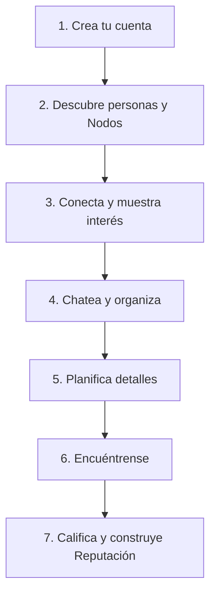

# NODUS - Un punto de encuentro 🚀

> **Conecta. Planea. Comparte.**  
> NODUS es la aplicación móvil diseñada para conocer personas reales, unirte a **Nodos** (grupos de interés/actividades) y coordinar planes que se convierten en experiencias memorables.

---

## 📸 Capturas de Pantalla

A continuación se presentan las secciones principales de la aplicación y la plataforma. 

| Sección / Pantalla | Vista Previa | Descripción |
| :--- | :---: | :--- |
| **Página Principal (Hero Section)** |  | Presentación general de la plataforma con badges de tiendas (App Store / Google Play) y métricas de la comunidad. |
| **Métricas y Estadísticas** |  | Indicadores clave: +100K usuarios, +50K conexiones reales, +10K Nodos creados y calificación de 4.8/5. |
| **Características Principales** |  | Tarjetas informativas de Perfiles Reales, Nodos, Planes Reales y Conexiones por intereses. |
| **Simulador de Interfaz de App (Móvil)** |  | Vista de las pestañas principales: *Descubre*, *Nodos*, *Conexiones*, *Mensajes* y *Perfil*. |
| **Flujo de Funcionamiento ("Cómo Funciona")** |  | Paso a paso interactivo desde el registro, descubrimiento, chat, hasta la valoración de reputación. |
| **Seguridad y Confianza** |  | Sistema de verificación de identidad, reputación entre usuarios y entorno protegido. |
| **Testimonios de Usuarios** |  | Reseñas y opiniones reales de miembros activos de la comunidad (Diego M., Valentina R., Camila S.). |
| **Pie de Página y Descarga QR** |  | Código QR para descarga directa, enlaces institucionales, soporte y redes sociales. |

---

## ✨ Características Destacadas

* 👤 **Perfiles Auténticos:** Sistema de verificación de identidad para garantizar un entorno seguro y con personas reales.
* 📍 **Nodos (Grupos de Actividades):** Explora e intégrate a eventos cercanos clasificados por categorías (Café & Charla, Noche de Juegos, Senderismo, etc.).
* 💬 **Chat y Coordinación:** Espacio directo para conversar, conocerse mejor y definir los detalles del encuentro.
* ⭐ **Sistema de Reputación:** Califica tus experiencias y retroalimenta a la comunidad para mantener un ambiente de alta confianza.

---

## 🔄 Flujo de Usuario (7 Pasos)

1. **Crea tu cuenta:** Regístrate en segundos y completa tu perfil con tus gustos (música, café, viajes, etc.).
2. **Descubre:** Explora perfiles y Nodos cercanos según tu ubicación.
3. **Conecta:** Muestra interés para generar conexiones auténticas.
4. **Chatea:** Entabla conversaciones para coordinar el plan.
5. **Planifica:** Confirma la fecha, hora y lugar del encuentro.
6. **Encuéntrense:** Vive experiencias reales y grupales.
7. **Reputación:** Califica la experiencia y fortalece la confianza dentro de la app.

---

## 📱 Descarga de la Aplicación

La aplicación está disponible para plataformas **iOS** y **Android**.

* **Google Play Store:** *(Enlace de descarga)* PROXIMAMENTE
* **Apple App Store:** *(Enlace de descarga)* PROXIMAMENTE

---

## 🛠️ Tecnologías Sugeridas / Stack

* **Frontend Web:** React / Next.js, Tailwind CSS
* **Mobile App:** React Native / Flutter
* **Backend:** Node.js / Python (FastAPI/Django)
* **Base de Datos:** PostgreSQL, Redis
* **Seguridad & Auth:** OAuth2, Verificación Biométrica / OTP

---

## 📄 Licencia y Derechos

© 2026 **NODUS**. Todos los derechos reservados.
